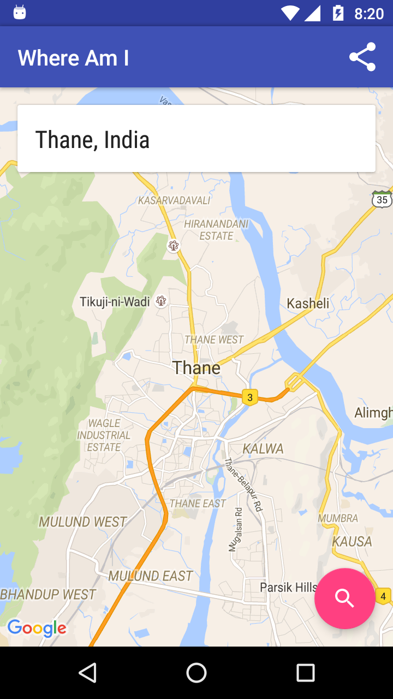
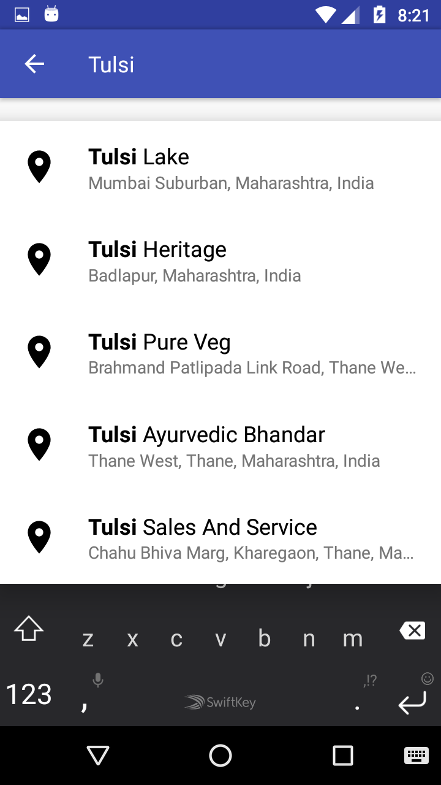
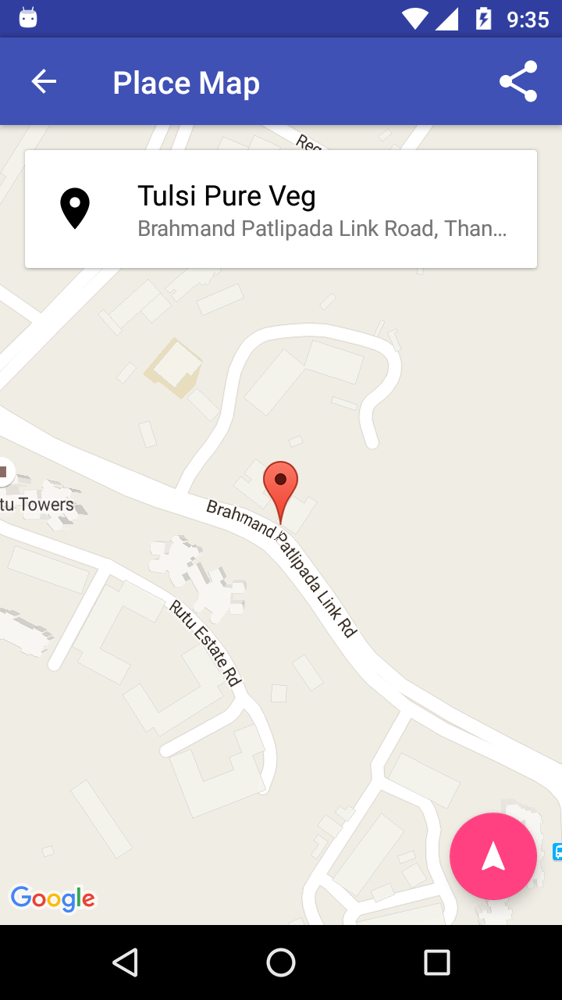

# WhereAmI&nbsp;&nbsp;&nbsp;&nbsp;

# APK

Debug APK - https://github.com/VaibhavSavla/WhereAmI/blob/master/assets/app-debug.apk

# Dependencies

 * Android Sdk Version 24
 * Google Maps Android API (Display Maps)
 * Google Places API for Android (autocomplete places)

# Screenshots

 
 

# Screen 1

 * Ask for users permission during runtime on Marshmallow devices.
 * Prompt user to turn on device location if it is off.
 * Fetch User location using LocationManager.
 * Display city level map using Google Maps Api for Android

Bonus: Share your full address using Direct Share Dialog.

# Screen 2

 * Using AutocompleteTextView along with custom ArrayAdapter to display places nearby matching user input.
 * Using AutocompletePrediction Api inside the ArrayAdapter to filter out the newarby places.
 * Based on the type of place different icons are shown Restraunt, ATM, Cafe etc.

# Screen 3

 * A map is shown according to the user selection.
 * Share the location using Direct Share Dialog.
